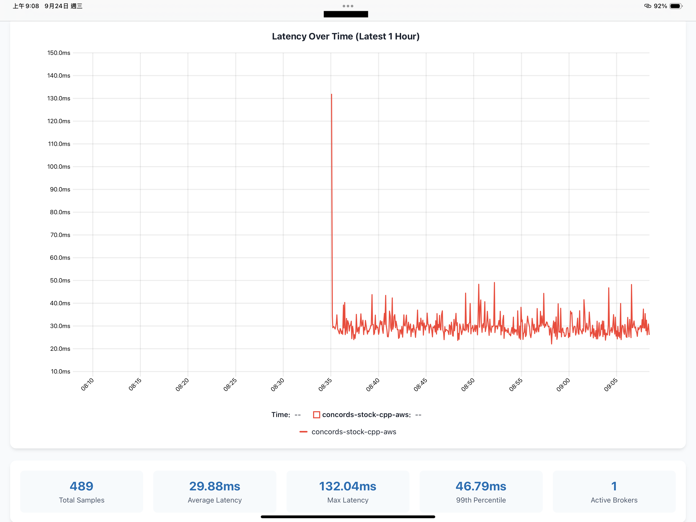

# 📊 Latency Dashboard

A modern web application for visualizing order execution latency across different brokers using advanced heatmap visualization. Built with Node.js, PostgreSQL, and uPlot.



## 🚀 Features

- **📈 Interactive Heatmap**: Real-time latency visualization using uPlot aggregated heatmap
- **📉 Time-Series View**: Per-broker latency lines for the most recent hour
- **🏢 Broker Analysis**: Compare latency performance across multiple brokers
- **⏰ Time-based Filtering**: Focus on trading hours (08:00-14:00 UTC+8)
- **📊 Statistical Insights**: Average, maximum, and 99th percentile latency metrics
- **✏️ HTTP Write API**: POST `/api/order-metrics` and `/api/network-metrics` on the dedicated write port for ingestion
- **🔄 Auto-refresh**: Data updates every 30 seconds

## 🛠️ Tech Stack

- **Backend**: Node.js + Express
- **Database**: PostgreSQL with optimized indexes
- **Frontend**: Pure JavaScript + uPlot visualization library
- **Containerization**: Docker + Docker Compose
- **Environment**: Environment variable configuration

## 📁 Project Structure

```
LatencyDashboard/
├── 🐳 Docker Configuration
│   ├── Dockerfile              # Node.js app container
│   ├── docker-compose.yml      # Multi-service orchestration
│   └── .env                    # Environment variables
├── 🗄️ Database
│   └── init.sql                # PostgreSQL schema & indexes
├── 🖥️ Application
│   ├── server.js               # Express read + write servers
│   ├── package.json            # Node.js dependencies
│   └── public/                 # Static web assets
│       ├── heatmap.html        # Latency heatmap page
│       └── latency.html        # Latency time-series page
├── 🔧 Scripts
│   ├── data/                   # Data generation tools
│   └── utils/                  # Database utilities
└── 📚 Documentation
    └── README.md               # This file
```

## 🏃‍♂️ Quick Start

### Prerequisites

- Docker & Docker Compose
- Node.js 18+ (for local development)

### 1. Clone & Setup

```bash
git clone <repository-url>
cd LatencyDashboard

# Create your local .env (see "Environment Variables" below for the full list).
cat > .env <<'EOF'
POSTGRES_DB=latency_db
POSTGRES_USER=admin
POSTGRES_PASSWORD=change_me
DB_HOST=localhost
DB_PORT=5432
APP_PORT=3000
WRITE_PORT=3001
EOF
```

### 2. Start Services

```bash
# Start PostgreSQL + Application
docker compose up -d

# Check services are running
docker compose ps
```

### 3. Generate Test Data

```bash
# Generate 6 hours of trading data
cd scripts/data/
node generate_data.js 6 "$(date -u +%Y-%m-%d)T08:00:00Z"

# Check data was inserted
cd ../utils/
./db_status.sh
```

### 4. Access Dashboard

- **Main Dashboard**:    http://localhost:3000
- **Latency Heatmap**:   http://localhost:3000/latency-heatmap
- **Time Series**:       http://localhost:3000/latency
- **Read API**:          http://localhost:3000/api/order-metrics
- **Write APIs**:        http://localhost:3001/api/order-metrics
                         http://localhost:3001/api/network-metrics

## 📊 API Reference

The application runs two HTTP servers:

| Server | Default Port | Purpose                |
| ------ | ------------ | ---------------------- |
| Read   | `APP_PORT`   | Dashboard pages + GETs |
| Write  | `WRITE_PORT` | Ingestion (POST)       |

### GET `/api/order-metrics`

Today's 08:00–14:00 (Asia/Taipei) trading window, used by the heatmap and
time-series page. Excludes rows where `total_ms` is `NULL` (i.e., failed orders).

```json
[
  { "timestamp": 1726250400, "broker": "BrokerA", "total_ms": 25.334 }
]
```

### GET `/api/order-metrics/timeseries`

Last 1 hour of successful orders, used by the latest-hour page.

### POST `/api/order-metrics`

Insert a single order metric. `broker`, `iteration_id`, and `outcome` are
required (enforced by DB `NOT NULL` / `CHECK`). Everything else is optional.
`timestamp` defaults to `NOW()` if omitted.

```json
{
  "timestamp":                 "2026-05-14T08:00:00+08:00",
  "iteration_id":              1234,
  "broker":                    "BrokerA",
  "outcome":                   "success",
  "error_message":             null,
  "total_ms":                  48.7,
  "sdk_local_ms":              0.4,
  "ack_rtt_ms":                25.1,
  "cancel_rtt_ms":             20.2,
  "minor_faults":              3,
  "major_faults":              0,
  "voluntary_ctxt_switches":   2,
  "involuntary_ctxt_switches": 0,
  "tcp_rtt_us":                21000,
  "tcp_rttvar_us":             1500,
  "tcp_snd_cwnd":              40,
  "tcp_retrans":               0
}
```

### POST `/api/network-metrics`

Insert a single network probe. `broker` and `iteration_id` are required.

```json
{
  "timestamp":                "2026-05-14T08:00:00+08:00",
  "iteration_id":              1234,
  "broker":                    "BrokerA",
  "dns_ms":                    1.8,
  "tcp_handshake_ms":          14.7,
  "tls_handshake_ms":          38.2,
  "tls_handshake_resumed_ms":  7.9,
  "resumption_supported":      true,
  "error":                     null
}
```

Both POST endpoints return `201` on success, `400` on constraint violations
(NOT NULL / CHECK), and `500` on other DB errors.

## 🔧 Configuration

### Environment Variables

Configure via `.env` file:

```env
# Database Configuration
POSTGRES_DB=latency_db
POSTGRES_USER=admin
POSTGRES_PASSWORD=your_secure_password
DB_HOST=localhost
DB_PORT=5432

# Application Configuration
APP_PORT=3000
WRITE_PORT=3001
```

### Database Schema

Two tables plus a joined view. See [init.sql](init.sql) for the full DDL.

- **`order_metrics`** — one row per order attempt. Records outcome, full timing
  breakdown (`total_ms`, `sdk_local_ms`, `ack_rtt_ms`, `cancel_rtt_ms`), kernel
  RTT (`tcp_rtt_us`), page-fault and context-switch counters. Timing columns are
  nullable so failed orders still produce a row for accurate success-rate math.
- **`network_metrics`** — one row per network probe. DNS, TCP, TLS handshake
  times plus a resumed-handshake variant.
- **`iteration_view`** — `order_metrics` left-joined against the closest
  `network_metrics` row by `(broker, iteration_id)` within ±1 minute. The time
  window prevents collisions when a process restart resets `iteration_id`.

### Timezone

The database, the server connection pool, and the dashboard pages all operate in
**`Asia/Taipei` (UTC+8)**. `init.sql` sets the database default timezone, and
`server.js` issues `SET TIME ZONE 'Asia/Taipei'` on every checked-out connection,
so `CURRENT_DATE`, `NOW()`, and `EXTRACT(...)` are consistent across every layer.

## 🎯 Usage Examples

### Generate Today's Trading Data
```bash
cd scripts/data/
node generate_data.js 6 "$(date -u +%Y-%m-%d)T08:00:00Z"
```

### Clear All Data
```bash
cd scripts/utils/
./clear_data.sh
```

### Load Historical Data
```bash
cd scripts/utils/
./load_data.sh path/to/historical_data.sql
```

### Check Database Status
```bash
cd scripts/utils/
./db_status.sh
```

## 📈 Data Model

### Data Generation

The dashboard charts read `total_ms` from `order_metrics`. The synthetic
generator produces both tables:

- **Order rows**: one per broker every 5 seconds. ~98% `outcome = 'success'`;
  the rest are randomly distributed across `ack_timeout`, `submit_error`,
  `cancel_timeout`, `cancel_error` with NULL timing. `total_ms` is the sum of
  `ack_rtt_ms` (≈N(25, 5)), `sdk_local_ms` (≈N(0.5, 0.2)), and `cancel_rtt_ms`
  (≈N(20, 4)), plus a small jitter. Kernel/OS counters are plausible but coarse.
- **Network rows**: one per broker per minute. `iteration_id` is aligned so the
  `iteration_view` LATERAL join can match them to the order rows in the same
  minute (12 orders per minute → network probe at `iteration_id = i * 12`).

## 🔍 Visualization Features

### Heatmap Controls

- **Broker Filter**: View specific broker or all brokers
- **Time Range**: Fixed 08:00-14:00 trading session
- **Auto Y-axis**: Dynamic latency range based on data
- **Color Coding**: HSL gradient (cyan → magenta) for density

### Statistics Panel

- **Total Samples**: Number of data points
- **Average Latency**: Mean execution time
- **Maximum Latency**: Worst-case execution time
- **99th Percentile**: P99 latency for SLA monitoring

## 🚀 Development

### Local Development

```bash
# Install dependencies
npm install

# Start development server
npm run dev

# Start database only
docker compose up postgres -d
```

### Database Management

```bash
# Connect to database
docker compose exec postgres psql -U admin -d latency_db

# View logs
docker compose logs -f app
docker compose logs -f postgres
```

## 🐛 Troubleshooting

### Common Issues

**Database Connection Failed**
```bash
# Check if PostgreSQL is running
docker compose ps postgres

# Check logs
docker compose logs postgres

# Verify environment variables
cat .env
```

**No Data Visible**
```bash
# Check if data exists
cd scripts/utils && ./db_status.sh

# Generate test data
cd ../data && node generate_data.js 6
```

**Port Already in Use**
```bash
# Change APP_PORT in .env
echo "APP_PORT=3001" >> .env

# Restart services
docker compose down && docker compose up -d
```

## 📋 TODO / Roadmap

- [ ] Real-time streaming data integration
- [ ] Historical data retention policies
- [ ] Additional broker connections
- [ ] Alert system for latency thresholds
- [ ] Export functionality (CSV, JSON)
- [ ] Multi-timezone support
- [ ] Performance benchmarking dashboard

## 📄 License

MIT License - see LICENSE file for details.

## 🤝 Contributing

1. Fork the repository
2. Create a feature branch (`git checkout -b feature/amazing-feature`)
3. Commit your changes (`git commit -m 'Add amazing feature'`)
4. Push to the branch (`git push origin feature/amazing-feature`)
5. Open a Pull Request

## 📞 Support

For questions or issues:
- Create an issue in this repository
- Check the troubleshooting section above
- Review the scripts documentation in `scripts/README.md`